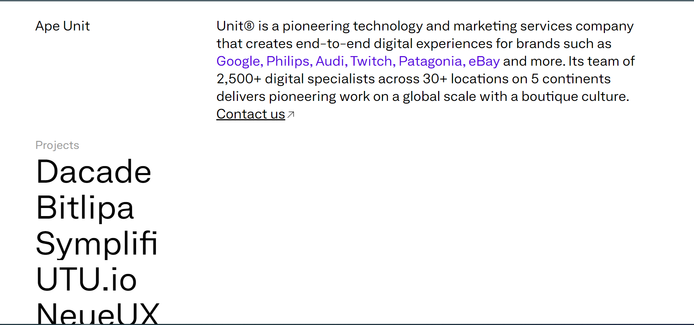

# Unit8 project

<a name="readme-top"></a>

[![Contributors][contributors-shield]][contributors-url]
[![Forks][forks-shield]][forks-url]
[![Stargazers][stars-shield]][stars-url]
[![Issues][issues-shield]][issues-url]

<!-- PROJECT LOGO -->
<br />
<div align="center">
  <a href="https://github.com/TheGymRwanda/unit8">
    
  </a>

  <h3 align="center">Unit➇ project</h3>

  <p align="center">
    Unit➇ is a landing page for Ape unit
    <br />
    <a href="https://github.com/TheGymRwanda/unit8"><strong>Explore the project »</strong></a>
    <br />
    <br />
    <a href="https://unit8-landing-yellow.netlify.app/">View Live Demo</a>
    ·
    <a href="https://github.com/TheGymRwanda/unit8/issues">Report Bug</a>
    ·
    <a href="https://github.com/TheGymRwanda/unit8/issues">Request Feature</a>
  </p>
</div>

<!-- TABLE OF CONTENTS -->
<details>
  <summary>Table of Contents</summary>
  <ol>
    <li>
      <a href="#about-the-project">About The Project</a>
      <ul>
        <li><a href="#built-with">Built With</a></li>
      </ul>
    </li>
    <li>
      <a href="#getting-started">Getting Started</a>
      <ul>
        <li><a href="#prerequisites">Prerequisites</a></li>
        <li><a href="#installation">Installation</a></li>
      </ul>
    </li>
    <li><a href="#usage">Usage</a></li>
    <li><a href="#contributing">Contributing</a></li>
  </ol>
</details>

<!-- ABOUT THE PROJECT -->

## About The Project



Unit➇ is a pioneering technology company specialing in decentralised technologies that creates end-to-end digital experiences for protocols including Ethereum, Tezos, Near, Algorand, Celo and more. Its team of 2,500+ digital specialists across 30+ locations on 5 continents delivers pioneering work on a global scale with a boutique culture.

<p align="right">(<a href="#readme-top">back to top</a>)</p>

### Built With

- Next js
- Tailwindcss

<p align="right">(<a href="#readme-top">back to top</a>)</p>

<!-- GETTING STARTED -->

## Getting Started

### Prerequisites

- npm
  ```sh
  npm install npm@latest -g
  ```

### Installation

1. Clone the repo
   ```sh
    git clone https://github.com/TheGymRwanda/unit8.git
   ```
2. Install NPM packages
   ```sh
   npm install
   ```
3. Run the development server
   ```sh
   npm run dev
   ```
   After those commands then you can Open [http://localhost:3000](http://localhost:3000) with your browser to see the result.

<p align="right">(<a href="#readme-top">back to top</a>)</p>

<!-- USAGE EXAMPLES -->

## Usage

now you are ready to go you can :

Open [http://localhost:3000](http://localhost:3000) with your browser to see the result.

<p align="right">(<a href="#readme-top">back to top</a>)</p>

<!-- CONTRIBUTING -->

## Contributing

Contributions are what make the open source community such an amazing place to learn, inspire, and create. Any contributions you make are **greatly appreciated**.

If you have a suggestion that would make this better, please fork the repo and create a pull request. You can also simply open an issue with the tag "enhancement".
Don't forget to give the project a star! Thanks again!

1. Fork the Project
2. Create your Feature Branch (`git checkout -b ft/AmazingFeature`)
3. Commit your Changes (`git commit -m 'Add some AmazingFeature'`)
4. Push to the Branch (`git push origin ft/AmazingFeature`)
5. Open a Pull Request

<p align="right">(<a href="#readme-top">back to top</a>)</p>

[contributors-shield]: https://img.shields.io/github/contributors/TheGymRwanda/unit8.svg?style=for-the-badge
[contributors-url]: https://github.com/TheGymRwanda/unit8/graphs/contributors
[forks-shield]: https://img.shields.io/github/forks/TheGymRwanda/unit8.svg?style=for-the-badge
[forks-url]: https://github.com/TheGymRwanda/unit8/network/members
[stars-shield]: https://img.shields.io/github/stars/TheGymRwanda/unit8.svg?style=for-the-badge
[stars-url]: https://github.com/TheGymRwanda/unit8/stargazers
[issues-shield]: https://img.shields.io/github/issues/TheGymRwanda/unit8.svg?style=for-the-badge
[issues-url]: https://github.com/TheGymRwanda/unit8/issues
[unit8-screenshot]: public/favicon.svg
